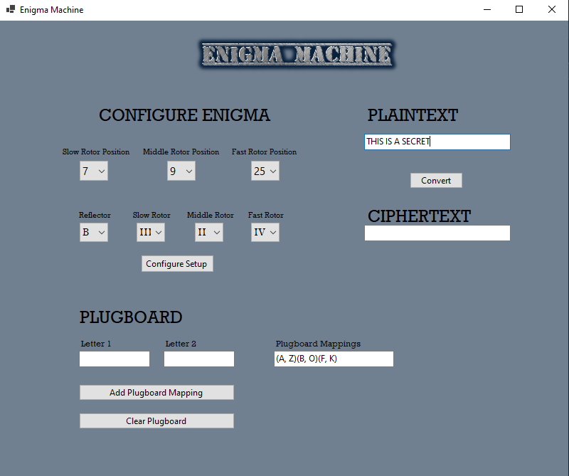
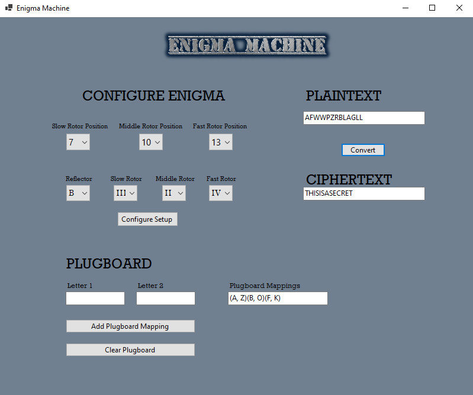

# GUI-Enigma-Machine

The Enigma machine was a cipher device used by the Germans in WWII to encrypt and decrypt secret military communications.

GUI Enigma Machine is a simulation of the original Enigma machine. It allows the user to encrypt and decrypt text through a GUI interface. You are able to select rotor wheels for 3 different rotors as well as reflector selection. You are also able to modify rotor position and add custom plugboard configurations.

### Features
- 3 Moving Rotors, slow, middle and fast
- Rotor Selection
- Rotor Position Selection
- Reflector Selection
- Mappable Plugboard

## Tech Stack

Languages: C#

Software: Visual Studio

## Images/Usage

### Entering text to be encypted (Plaintext box)

### Text has been encrypted (Ciphertext box)

### Entering the encrypted text to be decrypted (Plaintext box)

### Text has been decrypted successfully (Ciphertext box)

